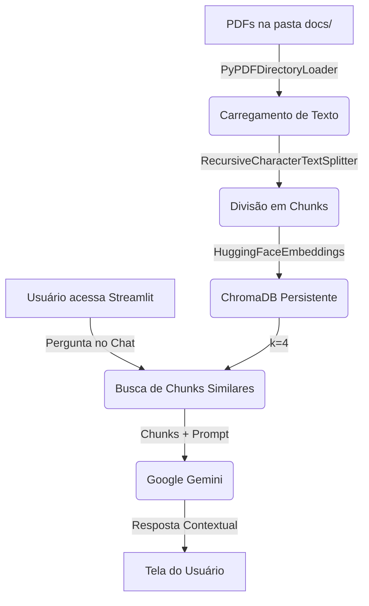

# Assistente RAG Inteligente com Google Gemini e LangChain

## Descrição do Projeto

Este projeto é um assistente inteligente completo baseado em **RAG (Retrieval-Augmented Generation)**. Ele permite fazer upload de documentos PDF e então fazer perguntas diretamente sobre o conteúdo desses materiais. A ferramenta processa os PDFs, armazena seus "vetores de conhecimento" localmente de forma persistente, e responde às dúvidas consultando a base e o modelo Google Gemini (via API).

## Como o RAG Reduz Alucinações?

O processo de RAG (Geração Aumentada por Recuperação) resolve o problema de alucinações (quando o modelo "inventa" informações) da seguinte forma:
1. **Recuperação Guiada**: Em vez de depender do conhecimento interno geral da inteligência artificial, buscamos a resposta em um banco de dados restrito (neste caso, os PDFs adicionados por você).
2. **Contextualização Estrita**: O pedaço de texto relevante encontrado nos seus arquivos é injetado junto com sua pergunta original num prompt.
3. **Restrição por Prompt**: Utilizamos uma instrução explícita de "Anti-Alucinação", forçando o modelo a responder APENAS com o texto fornecido ou a informar claramente que "Não encontrou essa informação", impedindo que ele complete com fatos externos.

## Diagrama da Arquitetura do Sistema



## Como Instalar e Executar (Passo a Passo)

### 1. Criar e Ativar Ambiente Virtual
No terminal, execute:
```bash
python -m venv venv
# No Windows:
venv\Scripts\activate
# No Linux/Mac:
source venv/bin/activate
```

### 2. Instalar as Dependências
```bash
pip install -r requirements.txt
```

### 3. Configurar a Chave da API
- Copie o arquivo `.env.example` e renomeie para `.env`.
- Adicione sua chave da API do Gemini (`GOOGLE_API_KEY`) ao arquivo.

### 4. Adicionar Documentos e Preparar o Banco
1. Coloque seus arquivos `.pdf` na pasta `docs/`.
2. Rode o loader (opcional para testar) ou apenas crie o banco diretamente rodando o embedder:
```bash
python src/embedder.py
```
Isso irá ler os PDFs e salvar o conhecimento processado na pasta `chroma_db/`.

### 5. Executar a Interface Chat
```bash
streamlit run src/app.py
```
A interface gráfica abrirá no seu navegador!

---

## Tabela de Avaliação

| ID | Pergunta | Precisão | Citação de Fontes | Latência (s) | Recusa Correta |
|----|----------|----------|-------------------|--------------|----------------|
| 1  | Qual é o objetivo principal do projeto? | N/A | N/A | N/A | N/A |
| 2  | Como faço para instalar e rodar os testes descritos? | N/A | N/A | N/A | N/A |
| 3  | Quais as tecnologias listadas na segunda página do documento? | N/A | N/A | N/A | N/A |
| 4  | Qual o limite de caracteres para um chunk? | N/A | N/A | N/A | N/A (Sim) |
| 5  | Qual é a receita para fazer um bolo de chocolate? | N/A | N/A | N/A | N/A (Sim) |
| 6  | Quem foi o primeiro presidente do Brasil? | N/A | N/A | N/A | N/A (Sim) |
| 7  | Resuma os três principais capítulos do PDF. | N/A | N/A | N/A | N/A |
| 8  | De acordo com o documento, qual é a data limite do projeto? | N/A | N/A | N/A | N/A |
| 9  | Quais são as limitações da técnica apresentada? | N/A | N/A | N/A | N/A |
| 10 | Quais as referências citadas no final do documento? | N/A | N/A | N/A | N/A |

### Metas de Avaliação
- **Precisão:** > 90% das respostas baseadas exclusivamente no material.
- **Citação de Fontes:** 100% de exibição das fontes subjacentes nas respostas.
- **Latência:** < 3 segundos por resposta para um fluxo fluido de conversação.
- **Recusa Correta:** 100% nas perguntas 4, 5 e 6 (perguntas propositalmente fora do contexto fornecido).

---

## Como Obter sua Chave Gratuita do Google Gemini
1. Acesse o [Google AI Studio](https://aistudio.google.com/app/apikey).
2. Faça login com a sua conta Google.
3. Clique no botão "Create API Key" (Criar Chave da API).
4. Em seguida, copie o código alfanumérico gerado.
5. Abra o seu projeto localmente, crie o arquivo `.env` (ou edite o `.env.example`) e adicione:
   `GOOGLE_API_KEY=ColeSuaChaveAqui`
